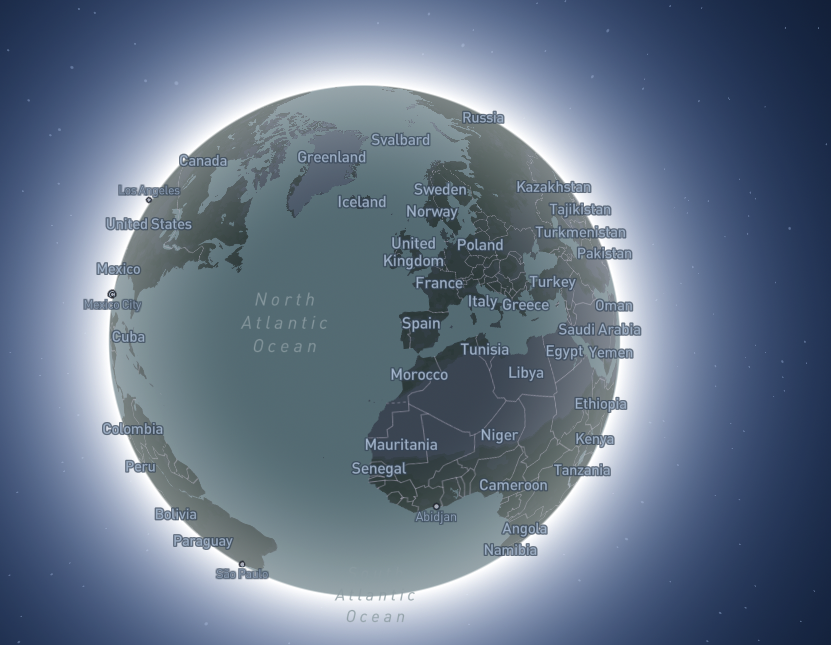

# Aplicación que muestra el mundo
### Descarga
1. Generar tu accessToken en la API:
[MapBox](https://docs.mapbox.com/)   
2. Descargar paquetes node_modules
```
yarn add o yarn
````
3. Lanzar app con:  
```
yarn dev
```  

Es una aplicación simple era para probar el nuevo paquete:  

```
 "react-map-gl": "^7.0.17"
```
### Imágenes
